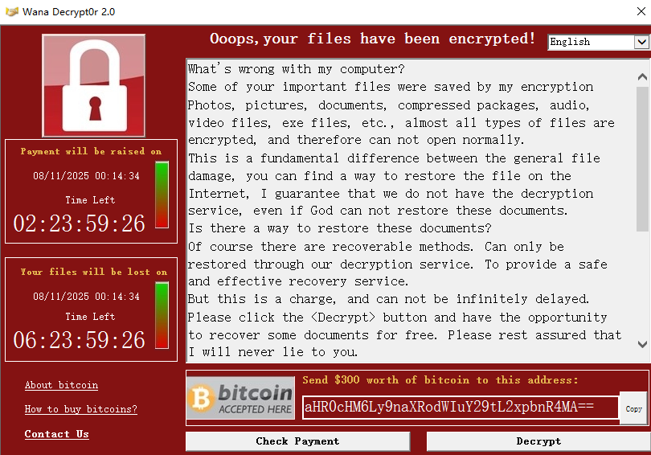
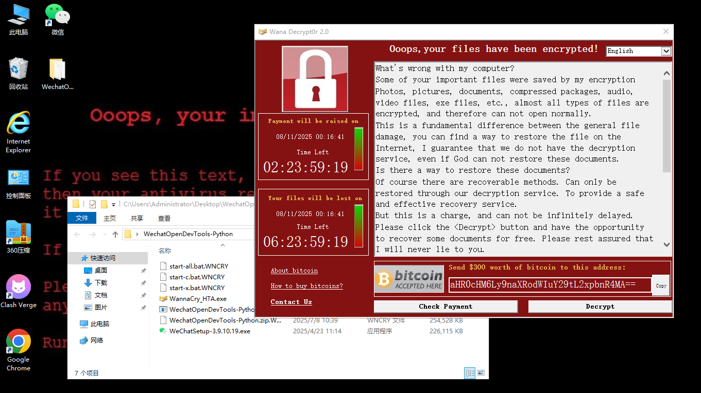
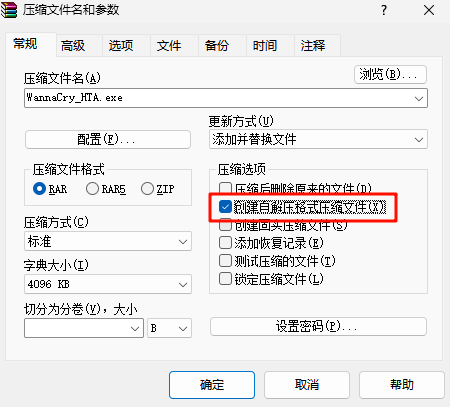
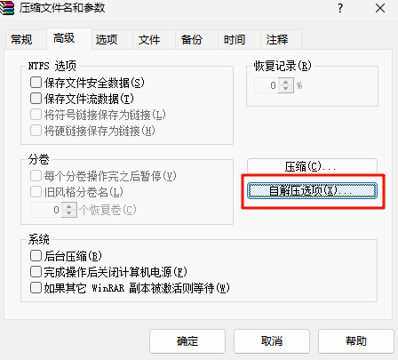
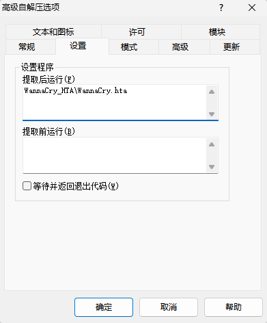
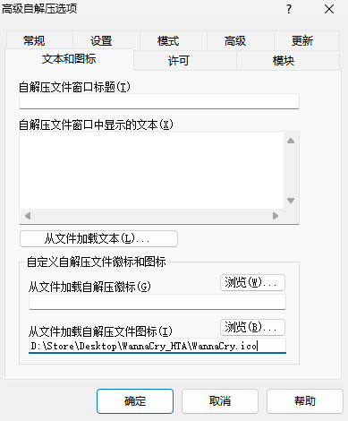
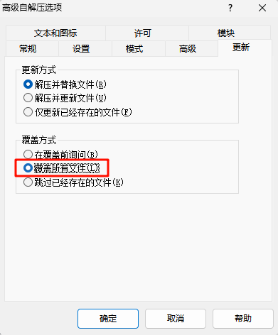
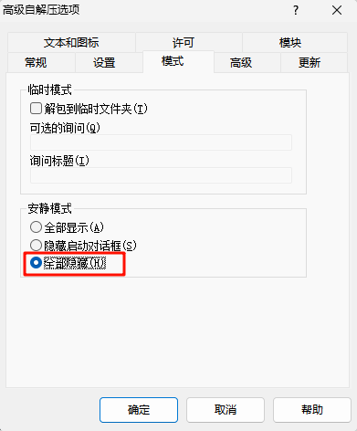

# WannaCry_HTA 完全可控勒索病毒模拟程序

## 🎯 项目简介

WannaCry_HTA 是一个基于 HTA（HTML Application）技术开发的高度仿真 WannaCry 勒索病毒界面模拟程序。该项目完全可控，专为安全研究、应急演练和安全教育场景设计。界面UI参考zR00t1师傅项目编写。

## ✨项目亮点：

1、完全可控，基于HTA，Windows系统直接运行无需编译，HTML实现精致仿真界面，调用VBS实现命令执行，DIY学习成本极低，适用安全服务应急演练场景和网络安全教育学习使用

2、通过ZIP自解压压缩包实现exe打包，可高度自定义程序图标等信息

3、高度可扩展，如果需要触发流量监控，只需要DIY VBS代码运行对应的程序或命令即可

## 📁实现功能：

1、基于HTA（HTML Application）编写的高度仿真WannaCry病毒界面

2、修改桌面背景（通过读取注册表图片地址，替换图片实现，不需要修改注册表）

3、调用VBS对WannaCry_HTA.exe目录下除exe文件外的所有文件修改后缀名为.WNCRY

## 🚀使用方法：

1、运行WannaCry_HTA.exe，即可实现程序目录下除exe文件外的所有文件均修改后缀名为.WNCRY，并修改桌面壁纸

2、点击Decrypt按钮即可恢复文件后缀和桌面壁纸

3、点击Check Payment按钮可再次运行加密命令，主动加密不会修改壁纸，修改壁纸需要重新运行程序，多次加密会提示已加密

## 📦自解压打包教程：

1、使用WinRAR压缩文件夹，选择创建自解压格式压缩包

2、高级菜单配置自解压选项

3、配置自解压后运行WannaCry_HTA\WannaCry.hta

4、配置文件图标

5、配置更新覆盖方式为覆盖所有文件

6、配置安静模式为全部隐藏

## ⚠️注意事项：

1、修改后缀，请在合适的环境和目录下运行程序，避免在系统目录等文件夹运行程序

2、修改壁纸，需要系统个性化壁纸设置为图片，如果为纯色壁纸则无法修改

3、目前仅在Win7和Win10环境下测试功能完整可用，其他环境壁纸修改可能失效

## 📄免责声明：

程序代码仅修改文件后缀和壁纸图片，完全可控，仅用于应急演练场景和安全学习使用

